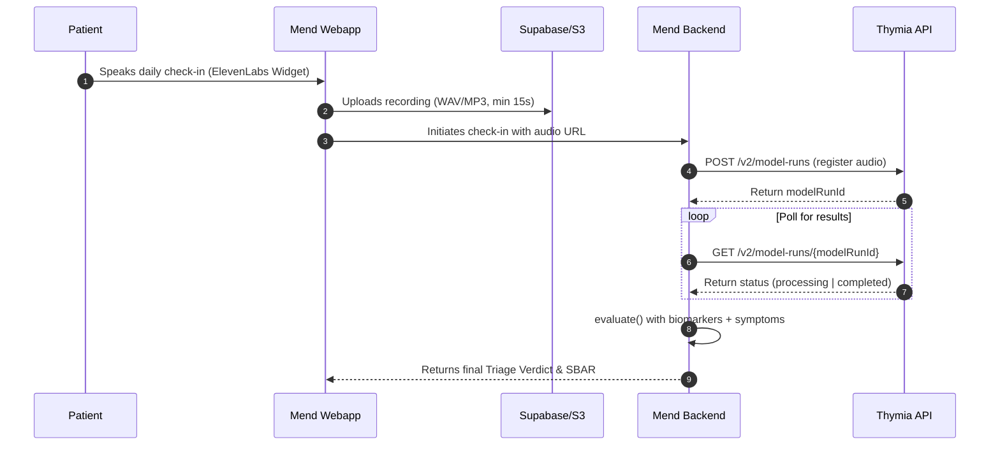

# Thymia Voice Biomarkers Integration Plan

This document outlines the implementation plan and technical specifications for integrating **Thymia's voice biomarker technology** into Mend. 

In an elderly post-operative cohort (such as our 82-year-old hip fracture persona), detecting **post-operative delirium (cognitive decline)** and **acute fatigue** is critical. Because patients with hypoactive delirium or progressive cardiovascular fatigue frequently under-report their symptoms, objective voice analysis provides a crucial safety net.

---

## 1. Clinical Rationale

Thymia analyzes natural speech patterns (pitch, pause intervals, rhythm, and tone) rather than spoken text to extract clinical signals:

| Biomarker | Clinical Indication in Post-Op Ortho | Triage Action |
|---|---|---|
| **Cognitive Slowing** | Early indicator of post-operative delirium or confusion (common in elderly POD 1–7). | **Amber Flag**: Suspected Delirium (even if transcript says "I feel fine"). |
| **Systemic Fatigue** | Signals physiological decompensation, poor oxygenation, or systemic distress. | **Amber Flag**: Critical fatigue levels (triggers clinical review of vitals). |
| **Depressive Mood / Stress** | Predicts poor rehab compliance, chronic pain tapers, and low engagement. | **Green/Info**: Alerts care team to adjust physical therapy coaching. |

---

## 2. API Integration Flows

Thymia offers two integration modes: **Asynchronous REST API** (processing recorded check-ins) and **Sentinel** (real-time stream analysis).

### Flow A: Asynchronous Audio Upload (REST API)
Ideal for standard check-ins where voice audio is recorded and processed post-call.



### Flow B: Live Real-Time Stream (Sentinel WebSockets)
Used during live conversational check-ins to evaluate biomarkers in real-time.

1. **Client** opens a WebSocket connection to Thymia Sentinel during the call.
2. **Audio chunks** are streamed in real-time.
3. **Thymia** emits updated biomarker scores every 10–15 seconds.
4. **Client** submits final scores alongside the voice transcript to `/api/checkin` on call completion.

---

## 3. Data Schema Specifications

We extend the clinical data models to ingest and store Thymia outputs.

### TypeScript Definition (`lib/clinical/types.ts`)
```typescript
export interface ThymiaBiomarkers {
  /** Cognitive slowing score: 0.0 (normal) to 1.0 (severe slowing/delirium risk) */
  cognitiveSlowing?: number;
  /** Systemic vocal fatigue: 0.0 (rested) to 1.0 (critical physiological fatigue) */
  fatigueIndex?: number;
  /** Mood/Stress index: 0.0 (stable) to 1.0 (high depressive/stress markers) */
  moodStressIndex?: number;
  /** Quality indicator of the voice sample: 'ok' | 'too_short' | 'noisy' */
  quality: "ok" | "too_short" | "noisy";
}
```

---

## 4. Deterministic Safety Rules

We update [red-flag-engine.ts](file:///Users/yashsewpaul/code/mend/lib/clinical/red-flag-engine.ts) to evaluate the biomarkers. Voice biomarkers are treated as **objective physiological data**, meaning they can trigger alerts even if subjective symptoms are denied.

```typescript
// Insert into lib/clinical/red-flag-engine.ts

if (biomarkers && biomarkers.quality === "ok") {
  // Suspected post-operative delirium
  if (biomarkers.cognitiveSlowing !== undefined && biomarkers.cognitiveSlowing > 0.7) {
    return amber(
      "Suspected post-op delirium",
      "Call your surgeon's office today — voice analysis indicates marked cognitive slowing which can be an early sign of post-operative confusion.",
      "surgeon_office",
      [`Objective voice biomarker cognitiveSlowing (${biomarkers.cognitiveSlowing}) exceeds safety threshold (0.7)`]
    );
  }

  // Systemic fatigue/decompensation
  if (biomarkers.fatigueIndex !== undefined && biomarkers.fatigueIndex > 0.8) {
    return amber(
      "Severe systemic fatigue",
      "Call the nurse line today to review your recovery progress — voice markers indicate severe physical exhaustion.",
      "nurse_line",
      [`Objective voice biomarker fatigueIndex (${biomarkers.fatigueIndex}) exceeds safety threshold (0.8)`]
    );
  }
}
```

---

## 5. UI/UX Design Proposal

To display these values premium-ly to the patient and care team:

1. **Voice Health Score Tile**: A new visual meter next to the Vitals tiles displaying the status of the speech biomarkers.
2. **Cognitive Stability Gauge**: A clean, animated radial gauge displaying cognitive processing speed and vocal fatigue.
3. **Audit Trail Panel**: Clinicians can expand the "Why" section to see the exact numeric scores returned from the Thymia API.

---

## 6. Implementation Steps

1. **Step 1**: Update the data schema and types in [types.ts](file:///Users/yashsewpaul/code/mend/lib/clinical/types.ts).
2. **Step 2**: Add Thymia rules to [red-flag-engine.ts](file:///Users/yashsewpaul/code/mend/lib/clinical/red-flag-engine.ts).
3. **Step 3**: Update the API route [route.ts](file:///Users/yashsewpaul/code/mend/app/api/checkin/route.ts) to accept the `biomarkers` payload.
4. **Step 4**: Extend the simulation layer in [vitals-feed.ts](file:///Users/yashsewpaul/code/mend/lib/sim/vitals-feed.ts) to return simulated biomarkers (e.g., elevated `cognitiveSlowing` for the "fever/confusion" demo scenarios).
5. **Step 5**: Render the biomarker tiles on the Next.js frontend ([page.tsx](file:///Users/yashsewpaul/code/mend/app/page.tsx)).
